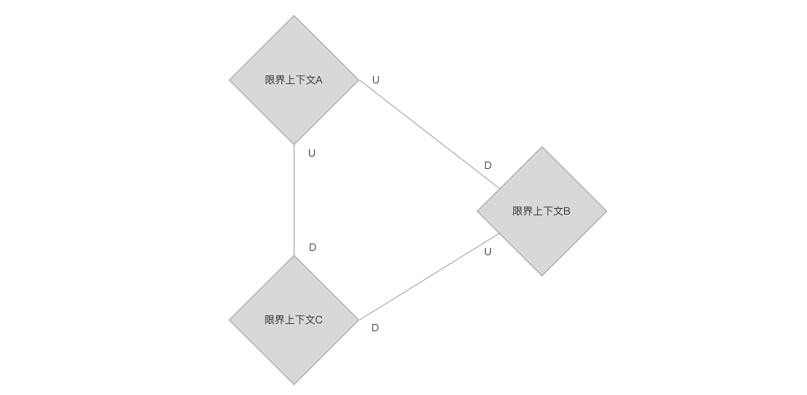
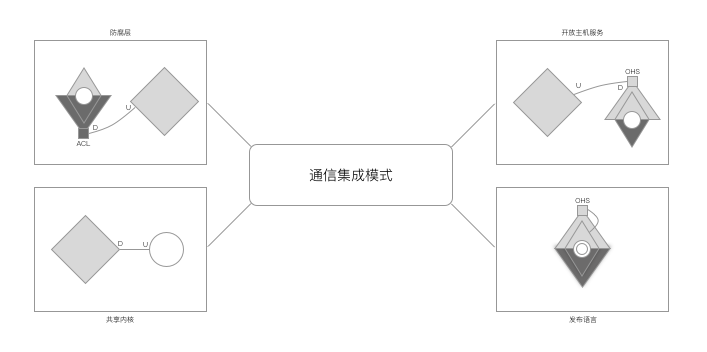
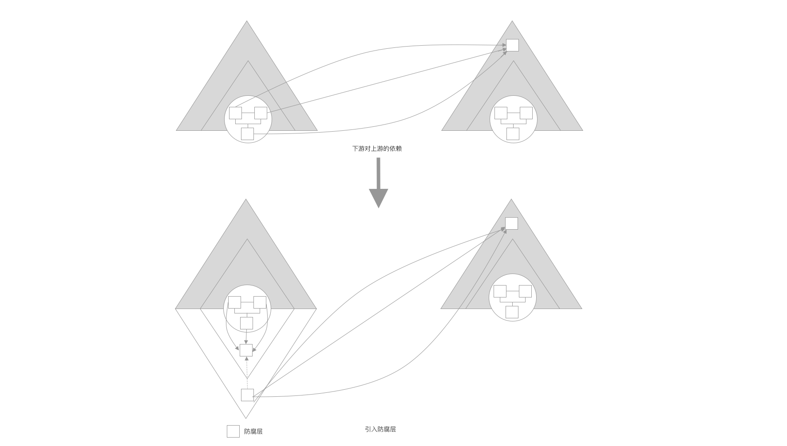
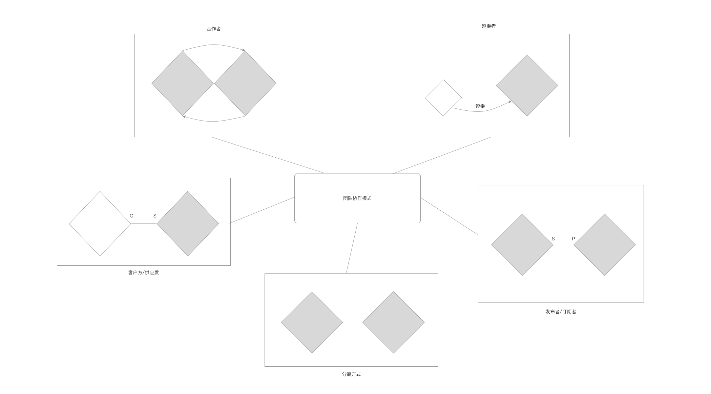
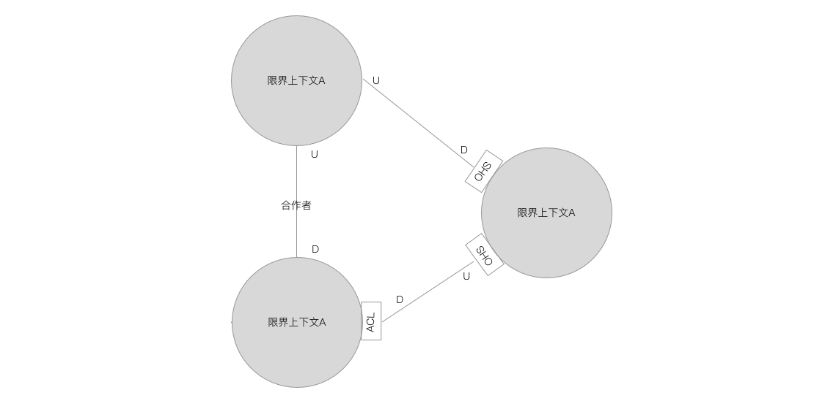

# 上下文映射
根据业务需求划分出边界清晰的限界上下文，为更好的展示系统全局视图，还需要考虑上下文的映射关系。

## 概述
上下文的映射目的：让软件模型、团队组织和通信集成之间的协作关系能够清晰呈现，为整个系统的各个领域特性团队提供一个清晰的视图，即上下文映射图。

上游：服务的供应方，用U表示
下游：服务的客户方，用D表示

`Eric Evans定义的上下文映射模式包括：客户方/供应方、共享内核、遵奉者、分离方式、防腐层、开放主机服务、发布语言、合作关系模式、大泥球模式。`

## 通信集成模式

与通信集成模式有关的上下文映射模式：

通信集成模式决定了限界上下文之间的协作质量。

通信集成模式包括：防腐层、开放主机服务、共享内核、发布语言。

### 防腐层（anti corruption layer, ACL）

“计算机科学中的大多数问题都可以通过增加一层间接性来解决。” —— David Wheeler

引入防腐层：在下游定义一个与上游服务对应的接口，即使上游服务变化也只影响防腐层，只要防腐层的接口不变，下游限界上下文的其他实现就不会受到影响。
防腐层只是上游服务的一个“代理”，并不包含正在的业务逻辑，业务逻辑皆有上游服务提供。

当每个下游限界上下文增加防腐层时，就会造成防腐层的代码重复，此时可以考虑将防腐层作为一个独立的限界上下文。

### 开放主机服务（open host service, OHS）
设计开放主机服务，就是定义公共服务的协议，包括通信的方式、传递消息的协议。同时，开放主机服务也是一种承诺，保证开放的服务不轻易做出改变。

进程作为划分通信边界的标准：
* 进程内组件之间的调用方式（本地服务）
    
    限界上下文在一个进程内，则应之间调用，避免分布式事务的一致性问题、性能问题以及通信的不可靠问题
    
* 跨进程组件之间的调用方式（远程服务）

    限界上下文不在同一个进程内，下游就需要调用上游的远程服务，需要遵循分布式通信的框架约束。

为了应对**通信边界**的变化，需要定义相同的服务契约，并将**防腐层**和**开放主机服务**结合起来，防腐层作为开放主机服
务的代理。

### 发布语言（published language）
发布语言是一种公共语言，用于两个限界上下文之间的模型转换。

引入发布语言的原因：为避免防腐层和开放主机服务在通信的时候引入各自的领域模型造成上下文之间的强耦合。

协议标准：
* 通信消息协议
    
    远程服务提供的消息协议，可采用的有XML、JSON、Protocol Buffer等。
* 内容定义的标准协议
    
    可以采用行业标准或者组织标准或采用项目定义的一套内部标准。
    针对特定的领域，还可以使用领域特定语言（Domain Specific Language,DSL）
    
### 共享内核
共享内核，则暴露了其限界上下文的领域模型，这就限制了对限界上下文边界的控制力。

“共享内核不能像其他设计部分那样自由更改。” —— Eric Evans

因此，只能将稳定且具有复用价值的领域模型对象封装到共享内核上下文中。

## 团队协作模式
与团队协作模式有关的上下文映射模式：

### 合作者
团队间协作紧密，相互依赖。

“当两个上下文中任意一个的开发失败会导致整个交付失败时，就需要努力迫使负责这个两个上下文的团队加强合作。” —— Eric Evans

合作方式有：一起做计划、一起提交代码、一起开发和部署、采用持续集成的方式保证两个上下文的集成度和一致性。

### 客户方/供应方
一个限界上下文为另一个提供服务，供应方作为上游服务，客户方作为下游服务。

供应方的职责：
* 排定服务的优先级
* 为服务提供统一的抽象
* 与客户方事先确定服务接口的定义
* 接口定义的修改要及时与客户方协商
* 尽可能地按计划交付
* 按计划未完成交付时，遵守预先定的服务接口

客户方的职责：
* 供应方的服务未实现时，需要模拟上游服务
* 提出对供应方未按时交付的情况的应对方案，评估带来的影响
* 如果有需求变化应及时告知上游团队

### 发布者/订阅者（publisher/subscriber）
通过事件总线，事件发布者将事件发布到事件总线，事件订阅者订阅事件，除了事件，他们彼此感知不到对方的存在。

事件发布者作为上游服务，与供应方不同的是，前者主动发布事件，而后者则是被动地由客户端来调用。

发布者/订阅者映射模式的两个团队，他们互为发布者和订阅者。

### 分离方式（separate way）
指的是两个限界上下文直接没有任何关系。即两种可以独立变化，也互不影响。

### 遵奉者
上游团队不积极响应下游团队的需求。 Eric Evan给出3个解决方案：
* 分离方式：切断对上游系统的依赖，自己实现
* 防腐层：分离方式代价太高时，可以考虑复用上游服务，下游团队自行开发领域模型，然后由防腐层实现模型之间的转换
* 遵奉者：严格遵从上游团队的模型，消除复杂的转换逻辑（即之间引用上游的领域模型）

遵奉者的优缺点：
优点：1.可以直接复用上下文的领域模型  2.减少了两个限界上下文的转换成本
缺点：对上游服务产生了强依赖

所以，遵奉者模式要尽量避免。

## 上下文映射的设计误区
在确定上下文映射之前需要明确上下文之间是否真的有协作关系。

* 语义关系形成的误区

* 对象模型形成的误区

## 上下文映射的确定

### 任务分解的影响
解决工厂问题，可以通过将一个大问题拆分成多个小问题，对每个小问题采用各自的解决方案解决，最后将结果组合

任务分解存在不同的抽象层次，视角的不同抽离的特征也就不同，分解处理的子任务所处的抽象层次也会不同，进而影响限界上下文之间协作的顺序。

任务分解遵循：**最小知识法则**（principle of least knowledge）
### 呈现上下文映射
上下文映射图 

* 菱形或椭圆代表限界上下文
* 连线代表限界上下文的协作关系
    * 虚线仅适用于发布者/订阅者模式
* 连线两端
    
    * 若C和S结合，代表客户方/供应方（Customer/Supplier）模式
    
    * 若P和S结合，代表发布者/订阅者（Publisher/Subscriber）模式
    
    * 遵奉者模式需要在连线上清晰说明为遵奉者（conformist）
    
    * 没有连线，说明为分离模式
    
    * 有连线无说明文字，则为合作者模式，也可用带有双向箭头的连线表示